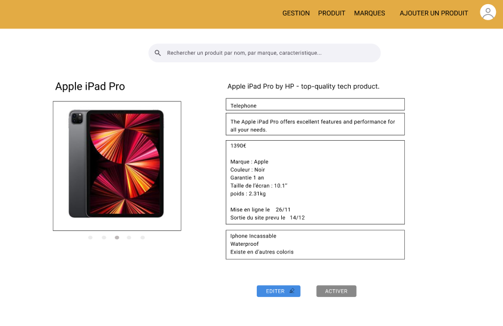
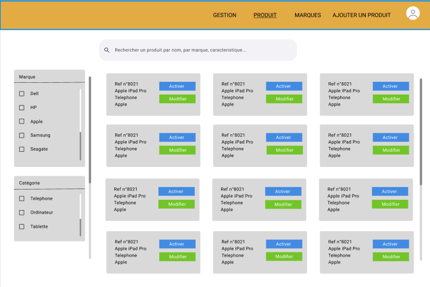
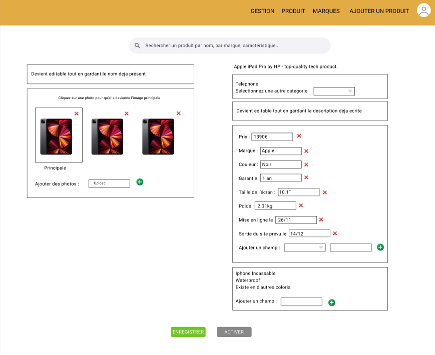

# PimpMyProduct

## Description

**PimpMyProduct** est une application de gestion complète pour les équipes produits permettant de gérer efficacement les informations des produits, les catégories, les images, les marques, ainsi que les utilisateurs de l'application.

### Fonctionnalités principales

- **Gestion des produits** :
  - Nom, description, résumé, statut, date de mise en place, date de sortie.
  - Informations de référencement web : balises OG et données structurées.
- **Gestion des images** :
  - Image principale, texte alternatif, et ajout d'images multiples.
- **Gestion des catégories, tags et labels** associés aux produits.
- **Gestion des marques** :
  - Envoi de notifications aux marques pour complément d'informations.
- **Gestion des utilisateurs** :
  - Deux niveaux d'accès : Admin et Collaborateurs.
  - Blocage automatique de l'accès à la plateforme à la date de sortie.
  - Envoi automatique des informations de connexion par email.

---

## Démo visuelle

### Liste des produits



### Édition d'un produit



### Détails du produit



---

## Technologies utilisées

### Backend

- **Node.js**
- **GraphQL** avec **Apollo Server**
- **TypeORM** pour la base de données
- **Type-GraphQL** pour les schémas GraphQL
- **PostgreSQL**
- **Argon2** pour le hashage des mots de passe
- **dotenv** pour la gestion des variables d'environnement

### Frontend

- **React 18** avec **TypeScript**
- **Vite** comme outil de build
- **Material-UI** (MUI) pour l'interface utilisateur
- **Apollo Client** pour les requêtes GraphQL
- **React Router** pour la navigation
- **Axios** pour les requêtes HTTP

### Tests & Linting

- **Jest** / **Vitest** pour les tests unitaires
- **ESLint** et **Prettier** pour le formatage et la qualité du code

---

## Pré-requis

Avant d'installer le projet, assure-toi d'avoir :

- **Node.js** >= 16
- **npm** ou **yarn**
- **PostgreSQL** installé

---

## Installation

Clone le projet et installe les dépendances :

````bash
# Cloner le repository
git clone https://github.com/WildCodeSchool-CDA-FT-2024-09/JS-CDA-Projet-2-Team-B.git
cd WildCodeSchool-CDA-FT-2024-09


## Structure du projet
```plaintext
PimpMyProduct/
├── api/                    # Backend
│   ├── auth/               # Authentification
│   ├── email/              # Gestion des emails
│   ├── product/            # Gestion des produits
│   ├── uploadimage/        # Gestion des images
│   ├── package.json        # Dépendances backend
│   └── jest.config.js      # Configuration des tests
│
├── client/                 # Frontend
│   ├── src/                # Code source React
│   ├── tests/              # Tests unitaires
│   ├── public/             # Fichiers statiques
│   ├── package.json        # Dépendances frontend
│   ├── vite.config.ts      # Configuration Vite
│   └── Dockerfile          # Déploiement
│
├── docker-compose.yml      # Configuration Docker
├── .env.sample             # Exemple de fichier .env
└── README.md               # Documentation
````

---

## Tests

Pour exécuter les tests :

```bash
# Backend
cd api
npm run test

# Frontend
cd ../client
npm run test
```

---

## Contribuer

Les contributions sont les bienvenues ! Pour proposer des modifications :

1. Fork le projet.
2. Crée une branche : `git checkout -b feature/ma-fonctionnalite`.
3. Commit tes modifications : `git commit -m "Ajout de la fonctionnalité"`.
4. Push vers ta branche : `git push origin feature/ma-fonctionnalite`.
5. Crée une Pull Request.

---

## Auteur

[Pierre DELAROCQUE](https://github.com/PierreDelarocque), [Johane Decamps](https://github.com/JohaneDecamps), [Nicolas Sokolowski](https://github.com/NicolasSokolowski), [Alexandre Graff](https://github.com/alexandreg67)

---
